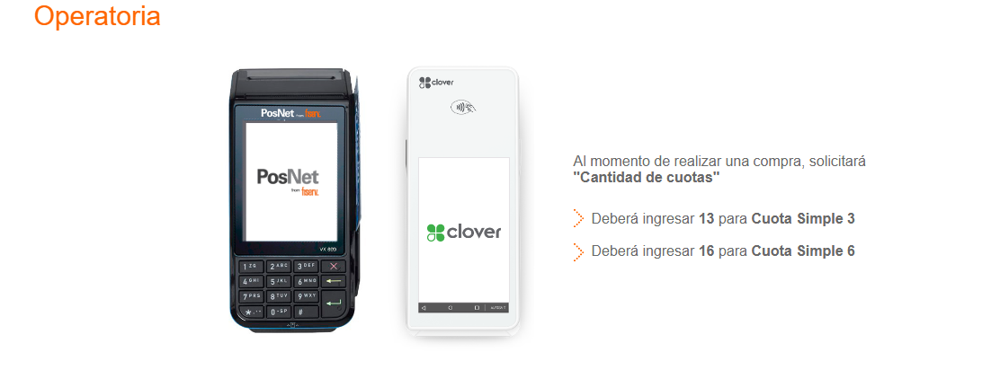

# simulador-de-costos-de-Cuota-Simple

## `Vigencia: del 05 de febrero de 2025 al 30 de junio de 2025.`
<!---
Se acualiza vigencia si cambia, y se actualiza vigencia en la web bajo el titula tambien
-->

### ¿Cómo se liquidan las Ventas al Comercio?
---

Cuota Simple 3  |  TNA > 44,55% |  TASA DIRECTA > 5,41%
<!---
Se acualiza taza
-->
---

Cuota Simple 6  |  TNA > 44,55% |  TASA DIRECTA > 10,31%  
<!---
Se acualiza taza
-->
---

### OPERATORIA
<!---
Screen de las tazas si se actualiza-->

